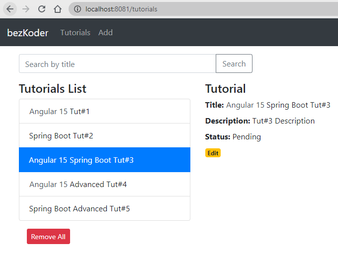

# 3-Tier Tutorial Application with Spring Boot + Angular + PostgreSQL

- Each Tutorial has id, title, description, published status.
- We can create, retrieve, update, delete Tutorials.
- We can also find Tutorials by title.

## Application Architecture

The application consists of a frontend, backend, and a database :

- The frontend is implemented using angular, if you're using this project locally you can start the local angular web server using ng serve -- {port_number} and access the frontend on http://localhost:{port_number}
- The backend is implemented using spring boot, and listens for API calls on the default port of 8080
- The database used is PostgreSQL with the default port of 5432

## How this Repo is Organized

This project repo consists of the following:
- Helm-chart: this is the folder containing the helm chart for deploying the application. It mainly deploys the frontend and backend services.
- Kubernetes-manifests: this folder contains raw k8s YAML manifest files for each service. It contains 4 subfolders for the frontend, backend, database, and shared resources like secrets.
- angular-15-client : this folder contains the source for the angular frontend.
- spring-boot-server: this folder contains the source for the spring boot backend.
- Jenkinsfile: This is the Jenkinsfile used for CI/CD pipeline deployment using jenkins
- README.md file 

## Deployment Steps

      
## Notes

